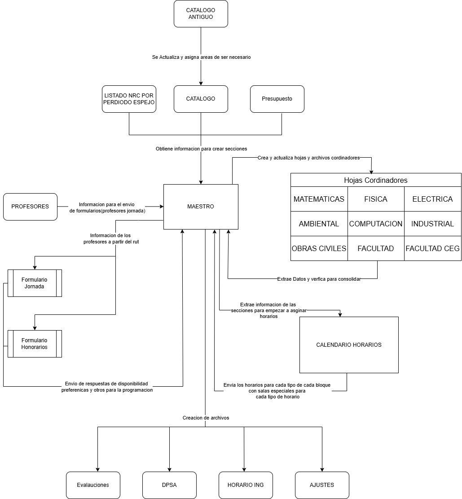

# Gestión Académica en Google Sheets 📋
Colección de códigos implementados en appscript de Google Drive para automatizar la programación Académica en base al siguiente esquema de relaciones:


## MAESTRO
### Descripción

Este script automatiza procesos administrativos relacionados con la gestión académica, como la creación y actualización de hojas de cálculo para diferentes áreas, validación de cambios en datos, y asignación de horarios o secciones. 
Está diseñado para usarse en el entorno de Google Sheets, utilizando Google Apps Script para integrar hojas de cálculo con funcionalidades personalizadas, conexión con appWeb de formularios.


### Requisitos

- Acceso a una cuenta de Google.
- Permisos para modificar Google Sheets a través de Google Apps Script de las diferentes hojas.
- Un archivo de hoja de cálculo de Google Sheets con las plantillas y datos necesarios:
    1. Hoja `MAESTRO` con el encabezado pero vacío
    2. `Presupuesto`
    3. `CATALOGO`
    4. `NRC POR PERIODO ESPEJO` semestre espejo con encabezado y la información desde la segunda fila
    5. Hoja `CATALOGO ANTIGUO`(opcional)
    6. Hoja `PROFESORES` con la información de los profesores de jornada con rut en la segunda columna
    7. Hoja `RESPUESTAS`,`PREFERENCIAS`,`OTROS`,`ENTREGADOS`Creadas y vacías para poder recibir las respuestas de los formularios
- Carpeta en Drive con permisos para crear las hojas de coordinadores


### Instalación

1. Abrir tu hoja de cálculo en Google Sheets.
2. Ir a `Extensiones` > `Apps Script`.
3. Copiar y pegar el código del script del repositorio de github en el editor de Apps Script manteniendo los archivos creados con el mismo nombre.
4. Guardar con CTR+S
5. Conectar el maestro a la carpeta coordinadores
6. Conectar el maestro al archivo de CALENDARIO HORARIOS
7. Agregar al maestro los links de los formularios
8. Agregar a las personas que tendran permisos a las hojas y recordar luego registrar a las personas que se les va a quitar permiso
```javascript
var id_hoja_programacion='1rMO2IPpYORUyfbQEgOfdTnfTOzGB9Q2b9lQaL9Rnrj4'//Hoja de programacion para los cursos
var id_archivo_actual="1o6HftjnQiU4EB1T9mwZ5FntfkZqy9Bj5wkZKbyHl-m0"//Cambiar aqui archivo actual
var id_carpeta_archivos_cordinadores="1esRVMIIXJhKiJqT4rwmQl1hQB78V6oL3"//Cambiar aqui carpeta cordinadores
var personas_para_envio_de_hojas =[
    {name:"Diego Lagos",mail:"diego.lagos.besoain@gmail.com",archivos:["MATEMATICA","COMPUTACION"]},
    {name:"Francisca Saez",mail:"fdsaez@uandes.cl",archivos:["INDUSTRIAL","ELECTRICA"]},
    {name:"Diego Eyzaguirre",mail:"deyzaguirre1@miuandes.cl",archivos:["FISICA","AMBIENTAL"]}
    //cambiar aqui las diferentes areas de cordinacion y sus encargados

  ]
var personas_para_quitar_permisos =[
    {name:"Diego Lagos",mail:"diego.lagos.besoain@gmail.com",archivos:["MATEMATICA","COMPUTACION"]},
    {name:"Francisca Saez",mail:"fdsaez@uandes.cl",archivos:["INDUSTRIAL","ELECTRICA"]},
    {name:"Diego Eyzaguirre",mail:"deyzaguirre1@miuandes.cl",archivos:["FISICA","AMBIENTAL"]}
    
    //cambiar aqui las diferentes areas de cordinacion y sus encargados

  ]
var linkFormulario1 = "https://script.google.com/macros/s/AKfycbzCbKj2BNb_o6ed9E97W5fV8bcLLaPIKwP97DWu3FU6lbxeZr4qqa-skLEAFxaKYKrP/exec"; // Cambiar por el link del formulario Honorarios
var linkFormulario2 = "https://script.google.com/macros/s/AKfycbyk0gcGoHVd4z46Vtsp49sgz5j_yomWypNpwG11HCpJpv5PDchXl3o6iyLvIYgZwaB9lA/exec";
```
10. Guardar los cambios.
11. Asegúrar de otorgar los permisos adecuados para ejecutar el script (autenticación).
12. Abrir el editor de Apps Script y selecciona la función que se desee ejecutar.
13. Hacer clic en el ícono de "Ejecutar" en el archivo 'Main" para iniciar el proceso.

- **Consideraciones:**
  - En caso de no existir o de modificar el nombre de las hojas, el programa puede presentar fallas en su funcionamiento.
  - Para hoja `NRC POR PERIODO ESPEJO` es improtante no cambiar el orden de las columnas, de lo contrario no podrá traer los cupos históricos ni los NRC existentes
### USO Y COMANDOS
- Agregar secciones: Toma toda la información que puede de las hojas `MAESTRO`, `Presupuesto`, `CATALOGO` para crear las entradas(filas) de todas las secciones en el maestro.
- Crear Calendario: Crea las fechas  al final de los datos de la hoja maestro para programar las pruebas en esos horarios, marcando en rojo los fines de semana
- Crear hojas por área: Separa la informacián creando una hoja y un nuevo archivo en la carpeta de cooridinadores con todos los cursos asociados a esa área para su revisión. Para el uso de este comando es importante que los mails de los cooridinadores ya estén ingresados en este punto.
- Enviar enlaces: Envía los enlaces y otorga permisos para la edición de los archivos para los cordinadores, los cuales van a recibir un mail automático.
- Quitar permisos de edición archivos coordinaldores: Sustrae los permisos de edición del mail asociado en el diccionario para las personas registradas
- Extraer datos Hojas cordinadores: Toma toda la información actual del archivo de coordinadores y la extrae en sus respectivas hojas dentro del maestro. Cualquier inserción, eliminacion o cambio dentro de las secciones de esa área resaltará la fila con colores.
- Validar Cambios: Este comando toma la hoja en la cual uno este actualmente, lo cual reemplaza y actualiza la información del maestro con la presente en la hoja del área donde se estén validando los datos (uno puede volver a crear hojas por área si desea actualizar la informacioón presente)
- Envio de formularios Jornada y honorarios: Envío automátioco de los links de formularios ingresados. Para esto se require que esté el rut y el mail del profesor en la hoja maestro. El programa hace la diferencia automáticamente en base a la informacion de la hoja `PROFESORES`
- Actualizar con datos formulario: Toma toda la informaciones recibida de los formularios y actualiza la información. A los profesores jornada se le asigna de forma automatica todo el horario disponible. En caso de que en un mismo curso se presenten diferentes disponibilidades el progrmaa solo deja las horas compartidas (intersección)
- Crear archivo para DPSA: Creación de los archivos en base a la asignación de pruebas y la información proveniente de Calendario horarios definiendo formato para las listas cruzadas y los conectores de liga, además crea un archivo de ajustes donde se presentarán todos los ajustes presentes desde la última ejecución de este comando, los ajustes se acumulan.
- Crear archivo para Alumnos: Creacion del HORARIO ING con todas las columnas necesarias para su creación incluyendo ligas y listas cruzadas
- Actualizar áreas con catalogo antiguo (Opcional): En caso de tener un catálogo antiguo con la columna de áreas vacía, se puede usar este comando para hacer los cruces y en caso de no encontrar ningun curso, se dejará en blanco y será necesario rellenar a mano
## CalendarioHorario
### Descripción
Este programa se dedica a la creacion y asignacion de horarios para cada tipod e reunion existente en cada asginatura para cada seccion, el programa se centre en la deteccion de restricciones presentes en al programacion de horarios para mas detalles de las restricciones visitar [la documentacion ](https://docs.google.com/document/d/18BQm9B1-aJW8mY22hJDP9fxbyFzg-mBxT-zZ_NI6Zqc/edit?tab=t.0) admeas actualiza automaticamente el maestro con los horarios asignados, adicionalemnte tien un sistema de visualizaciones y sistemas de colores para mejorar la comprension
### Requisitos

- Acceso a una cuenta de Google.
- Permisos para modificar Google Sheets a través de Google Apps Script de las diferentes hojas.
- Un archivo de hoja de cálculo de Google Sheets con las plantillas y datos necesarios:
    1. Hoja `DATOS MAESTRO` vacia
    2. Hoja `DETALLES SEMESTRE` vacia
    3. Hoja `SALAS ESPECIALES` con una columna de lista que se se usara como desplegable para las salas especiales(Tiene que se ingresado pro uno)
   
- Carpeta Hoja maestro creada y que el usuario que esta usando este programa tenga acceso de edicion a ella
### Instalación

1. Abre tu hoja de cálculo en Google Sheets.
2. Ve a `Extensiones` > `Apps Script`.
3. Copia y pega el código del script en el editor de Apps Script En los archivos creados con el mismo nombre.
4. Guarda los cambios.
5. Asegúrate de otorgar los permisos adecuados para ejecutar el script (autenticación).
6. Abre el editor de Apps Script y selecciona la función que desees ejecutar.
7. Conectar el calendario horarios al maestro en la liena 1 en el codigo entre comillas
 ```javascript
var id_hoja_maestro="1SxCL4Hzn_F9Uph1tAyvCETrNSi4TdoyE8c1v6LWytHE"
 ```   
9. Haz clic en el ícono de "Ejecutar" para iniciar el proceso.
 

- **Consideraciones:**
  - Las salas especiales que se cambien en la hoja `DATOS MAESTRO` no van a verse afectadas con las actulizaciones provenientes del maestro
  - es recomendable  dejar que los cambio ocrruan antes de ejecutar otros para evitar problemas de funcionamiento
  - Cualquier cambio en `DATOS MAESTRO` solo se va a ver reflejado cuando se actualizen las hojas
  - se peuden eliminar y agregar filas mientras mantengan sus horas a la derecha y tengan al menos una fila para cada hora
### USO Y COMANDOS
- Extraer datos maestro: extrae todas al informacion de cada seccion presente en el maestro ademas permite editar las salas especiales mediante un desplegable en base a la hoja `SALAS ESPECIALES` tambien agrega los detalles de semestre en la informacion
- Crear Templates: En base a la informacion de la extraccion de datos puede crear los horariso para cada hoja los cuales mantienen unas listas deplegables apra poder realizar la asignacion de horarios
- Actualizar Hojas: si se requiere usar nueva informacion despues de una extraccion de datos se puede actualizar las listas desplegables con este comendao el cual actualiza todas las hojas
- Enviar a maestro: envia toda la informacion actual en todas las hojas para crear los horarios en la hoja Maestro en el archivo MAESTRO de forma atomatica

--
VISUALIZACIONES(Todas Las Hojas): Crea una hoja de visualizacion del semestre indicado que agrupa por seccion y tipo de reunion
VERIFICAR TOPES MISMO SEMESTRE(Todas Las Hojas): verifica topes de cursos que se encuentren en el mismo semestre y esten asignados a un mismo bloque horario
VERIFICAR SALAS ESPECIALES(Todas Las Hojas): Busca la restriccion de uso de una misma sala especial en un miesmo bloque horario esto sucede tanto en un mismo semestre como en las diferentes hojas se basa en la informacio presente en  `DATOS MAESTRO` para las salas especiales busca en todo tipo de reunion
VERIFICAR DISPONIBILIDAD PROFESOR(Todas Las Hojas):Busca que se este cumpliendo con la disponibilidad entregada por el profesor y ademas de que no se seste asignando en un mismo bloque horario para diferentes secciones de diferentes asignaturas
VERIFICAR HORARIOS PROTEGIDOS(PLAN COMUN/V,VI): Busca asignaciones en diferentes bloques para horarios protegidos
VERIFICAR CONCENTRACIONES(V,VI,VI,VII):Busca topes con ramso del mismo semestre con alguna conecntracion en base a sus detalles semestre ocupa la restriccion de P para permitir topes y no toma en cuenta ramos compartidos para evitar falsos topes

## FORMULARIOS
### Descripción
Estos codigos pertenecen a implementacions web dentro de appscript que automatizan y crean formularios dinamicos en base a la informacion del maestro para la disponibilidad y preferencias de los profesores automaticamente envian las respuestas a la hoja maestro


### Requisitos

- Acceso a una cuenta de Google.
- Permisos para modificar Google Sheets a través de Google Apps Script de las diferentes hojas.
- Tener el maestro con permisos para Editar el archivo MAESTRO para que puedan llegar las respuestas
- Permisos para la implementacion de appscripts en proyecto 


### Instalación

1. Abre tu hoja de cálculo en Google Sheets.
2. Ve a `Extensiones` > `Apps Script`.
3. Apretar el icono de `Apps Script`
4. ir a `Nuevos Proyectos`
5. Agregar todos los archivos con sus respectivas extenciones y crear los archivos con el mismo nombre que aparece en el repositorio, posteripirmente copiar el contenido de esos archivos
6. Asegúrate de otorgar los permisos adecuados para ejecutar el script (autenticación).
7. Abre el editor de Apps Script y selecciona la función que desees ejecutar.
8. Conectar los formularios al maestro donde se desea que lleguen las respuestas mediante el id en la linea 1 donde dice
 ```javascript
var id_hoja_maestro="1SxCL4Hzn_F9Uph1tAyvCETrNSi4TdoyE8c1v6LWytHE"
 ```
10. Haz clic en el ícono de "Ejecutar" en el archivo "Backend.gs" para iniciar el proceso.
11. Relizar una `Extensiones` > `appWeb` > `ejecutar como yo` > `Cualquier persona`> `Implementar`
12. pasarle este link al maestro para que pueda enviarlo de forma automatica

- **Consideraciones:**
  - Este proceso se teien que realizar para ambos formularios
  - En caso de tener algun problema para abrir el formulario se recomienda abrir en otro navegador  o en modo ingocnito
  - Si se requiere que un profesor responda nuevamente se deber borrar su rut en la hoja `Entregados` del ARCHIVO maestro al cual se esten eviando respuestas


    


